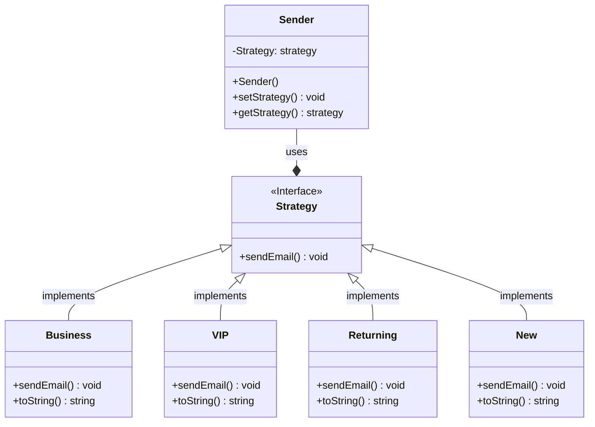

# Project Template

This is a Java Maven Project Template


# How to compile the project

We use Apache Maven to compile and run this project. 

You need to install Apache Maven (https://maven.apache.org/)  on your system. 

Type on the command line: 

```bash
mvn clean compile
```

# How to create a binary runnable package 


```bash
mvn clean compile assembly:single
```


# How to run

```bash
mvn -q clean compile exec:java -Dexec.executable="edu.bu.met.cs665.Main" -Dlog4j.configuration="file:log4j.properties"
```

# Run all the unit test classes.


```bash
mvn clean compile test checkstyle:check  spotbugs:check
```

# Using Spotbugs to find bugs in your project 

To see bug detail using the Findbugs GUI, use the following command "mvn findbugs:gui"

Or you can create a XML report by using  


```bash
mvn spotbugs:gui 
```

or 


```bash
mvn spotbugs:spotbugs
```


```bash
mvn spotbugs:check 
```

check goal runs analysis like spotbugs goal, and make the build failed if it found any bugs. 


For more info see 
https://spotbugs.readthedocs.io/en/latest/maven.html


SpotBugs https://spotbugs.github.io/ is the spiritual successor of FindBugs.


# Run Checkstyle 

CheckStyle code styling configuration files are in config/ directory. Maven checkstyle plugin is set to use google code style. 
You can change it to other styles like sun checkstyle. 

To analyze this example using CheckStyle run 

```bash
mvn checkstyle:check
```

This will generate a report in XML format


```bash
target/checkstyle-checker.xml
target/checkstyle-result.xml
```

and the following command will generate a report in HTML format that you can open it using a Web browser. 

```bash
mvn checkstyle:checkstyle
```

```bash
target/site/checkstyle.html
```

# E-mail Generation Application

Github link to repository containing my E-mail Generation App: https://github.com/metcs/met-cs665-assignment-3-thornicek

# Structure 

This application is a simple e-mail template application, which is used for generating e-mail templates for different types of customers. In my application I have applied the State pattern. My application consists of 5 classes, an interface and a Main class, where all the testing is done. The Sender class is responsible for setting the state or the strategy for the email to be sent. The Sender class uses the Strategy interface, to create an object that implements the Strategy interface. The Strategy interface is also used for all the remaining 4 classes that represent the type of customer/partner: Business class, VIP class, Returning class and New class. Each of the 4 classes implement the sendEmail method, that gets overriden in each of the classes. The 4 classes have also a toString method, that shows the state/strategy, that the user is using for sending out email templates.  

## UML

# How flexible is your implementation?

My code is fairly flexible, as new customers of the same type/same class, can receive the email template by creating an object of the same type/class. New email templates can be added by adding new class.

# How is the simplicity and understandability of your implementation?

My code is simple, it has a sender class, which shows the state/strategy that is implemented. Then it has 4 classes representing the 4 customer/partner types, with all the 4 classes implementing the Strategy interface, which has a sendEmail method.

# How you avoided duplicated code?

By creating a class for each customer and setting the template for each class once, I have avoided writing out the email template, every time I add a new customer. Customers/partners of the same type/class receive new emails, only by creating an object of their class and using the overriden sendEmail method.
