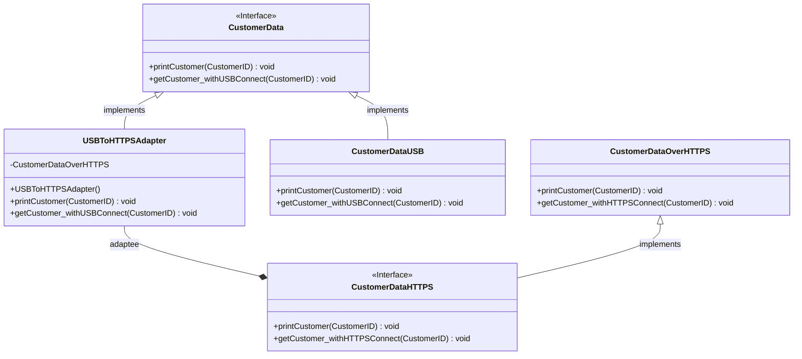

# Project Template

This is a Java Maven Project Template


# How to compile the project

We use Apache Maven to compile and run this project. 

You need to install Apache Maven (https://maven.apache.org/)  on your system. 

Type on the command line: 

```bash
mvn clean compile
```

# How to create a binary runnable package 


```bash
mvn clean compile assembly:single
```


# How to run

```bash
mvn -q clean compile exec:java -Dexec.executable="edu.bu.met.cs665.Main" -Dlog4j.configuration="file:log4j.properties"
```

# Run all the unit test classes.


```bash
mvn clean compile test checkstyle:check  spotbugs:check
```

# Using Spotbugs to find bugs in your project 

To see bug detail using the Findbugs GUI, use the following command "mvn findbugs:gui"

Or you can create a XML report by using  


```bash
mvn spotbugs:gui 
```

or 


```bash
mvn spotbugs:spotbugs
```


```bash
mvn spotbugs:check 
```

check goal runs analysis like spotbugs goal, and make the build failed if it found any bugs. 


For more info see 
https://spotbugs.readthedocs.io/en/latest/maven.html


SpotBugs https://spotbugs.github.io/ is the spiritual successor of FindBugs.


# Run Checkstyle 

CheckStyle code styling configuration files are in config/ directory. Maven checkstyle plugin is set to use google code style. 
You can change it to other styles like sun checkstyle. 

To analyze this example using CheckStyle run 

```bash
mvn checkstyle:check
```

This will generate a report in XML format


```bash
target/checkstyle-checker.xml
target/checkstyle-result.xml
```

and the following command will generate a report in HTML format that you can open it using a Web browser. 

```bash
mvn checkstyle:checkstyle
```

```bash
target/site/checkstyle.html
```

# Integrating Legacy System Application

Github link to repository containing my Integrating Legacy System App: https://github.com/metcs/met-cs665-assignment-4-thornicek

# Description

This application is used to integrate an old legacy system with a newly developed system. The old legacy system retrieves the customer data using USB connection
and the newly developed system uses HTTPS connection to retrieve the customer data. This application uses the adapter pattern to integrate the old legacy system 
with the newly developed system.

# Structure 

This application consists of 2 interfaces; CustomerData and CustomerDataOverHTTPS. The CustomerData interface is used for the old legacy system and is used to enforce the methods for retrieving the customer data with USB connection. The CustomerDataOverHTTPS interface is used for the newly developed system and is used to enforce the methods for retrieving the customer data with HTTPS connection.

This application consists of 5 classes; USBToHTTPAdapter, CustomerID, CustomerDataUSB, CustomerDataHTTPS. The CustomerID class is used to create the customer object with 
an id. The CustomerDataUSB class implements the CustomerData interface and is responsible for retrieving the data using USB connect. The CustomerDataHTTPS class implements 
the CustomerDataOverHTTPS interface and is responsible for retrieving the data using HTTPS connect. The USBToHTTPAdapter class implements the CustomerData interface and is
responsible for mapping the USB connect and print methods back to the adaptee and then handles it. 


## UML

# How flexible is your implementation?

In my opinion my implementation is very flexible, as the adapter pattern integrates the old interface with the new. This avoids rewriting a lot of the old code.


# How is the simplicity and understandability of your implementation?

In my opinion my implementation is simple and easy to understand. In my implementation there is an old system interface that is implemented by the old class and then there is
the newly developed interface that is implemented by the newly developed class. The adapter changes integrates the old interface with the new, without having to change the implementation of the old interface and old class.


# How you avoided duplicated code?

I avoided duplicate code by using interfaces and by using polymorphism to override the  existing interfaces. The use of an adapter pattern avoids duplicate code, as the adapter pattern introduces only one object and no additional pointer indirection is needed to get to the adaptee. 


