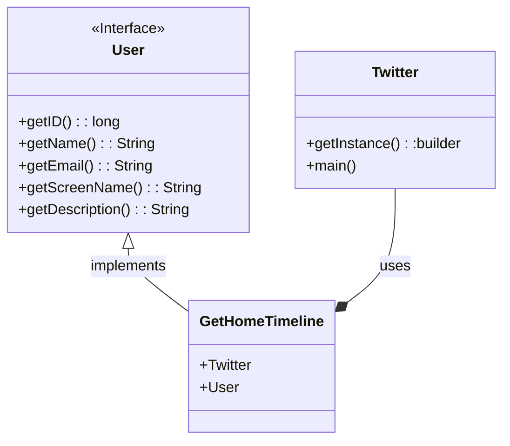
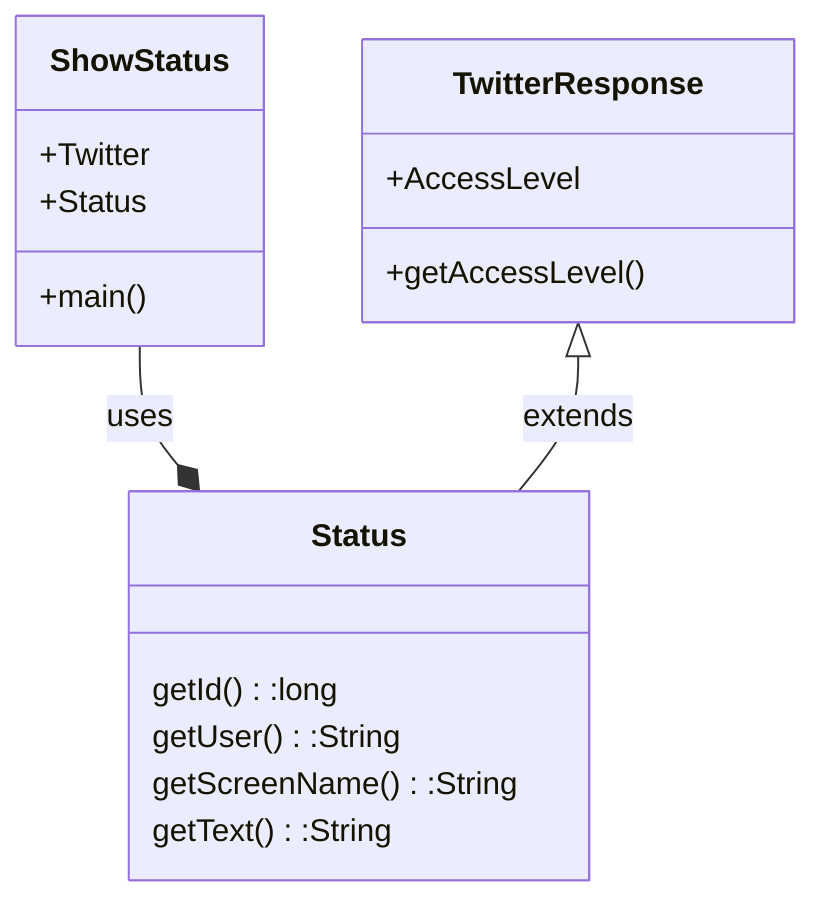
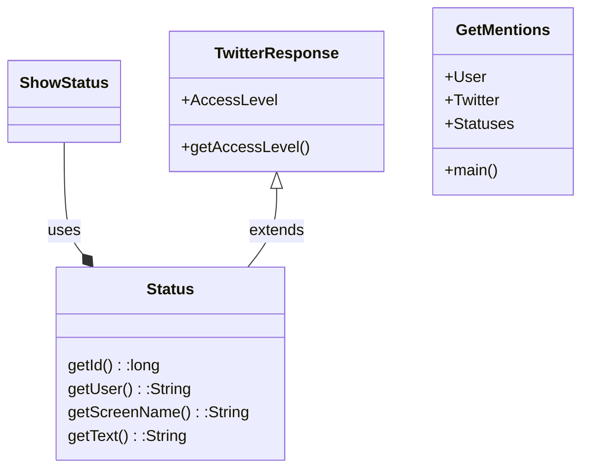

# Project Template

This is a Java Maven Project Template


# How to compile the project

We use Apache Maven to compile and run this project. 

You need to install Apache Maven (https://maven.apache.org/)  on your system. 

Type on the command line: 

```bash
mvn clean compile
```

# How to create a binary runnable package 


```bash
mvn clean compile assembly:single
```


# How to run

```bash
mvn -q clean compile exec:java -Dexec.executable="edu.bu.met.cs665.Main" -Dlog4j.configuration="file:log4j.properties"
```

# Run all the unit test classes.


```bash
mvn clean compile test checkstyle:check  spotbugs:check
```

# Using Spotbugs to find bugs in your project 

To see bug detail using the Findbugs GUI, use the following command "mvn findbugs:gui"

Or you can create a XML report by using  


```bash
mvn spotbugs:gui 
```

or 


```bash
mvn spotbugs:spotbugs
```


```bash
mvn spotbugs:check 
```

check goal runs analysis like spotbugs goal, and make the build failed if it found any bugs. 


For more info see 
https://spotbugs.readthedocs.io/en/latest/maven.html


SpotBugs https://spotbugs.github.io/ is the spiritual successor of FindBugs.


# Run Checkstyle 

CheckStyle code styling configuration files are in config/ directory. Maven checkstyle plugin is set to use google code style. 
You can change it to other styles like sun checkstyle. 

To analyze this example using CheckStyle run 

```bash
mvn checkstyle:check
```

This will generate a report in XML format


```bash
target/checkstyle-checker.xml
target/checkstyle-result.xml
```

and the following command will generate a report in HTML format that you can open it using a Web browser. 

```bash
mvn checkstyle:checkstyle
```

```bash
target/site/checkstyle.html
```
# Twitter Design Pattern Analysis

# Description

# Factory Pattern

The Twitter App uses the factory pattern to display a home timeline for a user in the twitter4j-examples/src/main/java folder, under examples.timeline package. The Twitter app calls the GetHomeTimeline class, which creates objects based upon the User interface, and fetches the data that is relevant to the user in question. Based up on the data and the method in the Twitter class a home timeline is rendered for the specific user. 

The factory pattern is very effective in this case, as the home timeline can class can be reused for an infinite number of users and it will always be user specific for the user in question. Also, if in the future, twitter decides to divide their users, into VIP and normal for example, it can be easily done by overriding and overloading the User interface.

## UML

# Observer Pattern

The Twitter App uses an observer pattern, which is no suprise as the observer pattern is ideal for social media, as it notifies subscribers of a change of state. This pattern can be found in twitter4j-examples/src/main/java folder, under examples.tweets package. In this example there is a ShowStatus class, which calls the Status class methods in order to show the status posted by a user on the Twitter page. The Status class also inherits from the TwitterResponse class, which has methods that decide, what users get access to the post. When a user posts a status, all the subscribers(or users that are following the user) get notified on their homepage, therefore we can confirm this is an observer pattern. This pattern is very easy to reuse, as everytime the user gets followed by another user, the user that followed them, will get access to the tweet and notified on their home page.

## UML

# Singleton Pattern

Singleton pattern is also used in the Twitter App, which is no suprise, as it is one of the most commonly used design pattern.This pattern can be found in twitter4j-examples/src/main/java folder, under examples.timleine package. The Singleton pattern defines an instance operation, that lets other clients or classes access its unique instance, which in this case is getUser() or getID()(in the Status class). The singleton pattern uses encapsulation to have strict control over how and when the user accesses the sole instance(getUser()). The Singleton pattern also promotes code resuability, as that one instance can be used across a lot of classes. 

## UML

