# Project Template

This is a Java Maven Project Template


# How to compile the project

We use Apache Maven to compile and run this project. 

You need to install Apache Maven (https://maven.apache.org/)  on your system. 

Type on the command line: 

```bash
mvn clean compile
```

# How to create a binary runnable package 


```bash
mvn clean compile assembly:single
```


# How to run

```bash
mvn -q clean compile exec:java -Dexec.executable="edu.bu.met.cs665.Main" -Dlog4j.configuration="file:log4j.properties"
```

# Run all the unit test classes.


```bash
mvn clean compile test checkstyle:check  spotbugs:check
```

# Using Spotbugs to find bugs in your project 

To see bug detail using the Findbugs GUI, use the following command "mvn findbugs:gui"

Or you can create a XML report by using  


```bash
mvn spotbugs:gui 
```

or 


```bash
mvn spotbugs:spotbugs
```


```bash
mvn spotbugs:check 
```

check goal runs analysis like spotbugs goal, and make the build failed if it found any bugs. 


For more info see 
https://spotbugs.readthedocs.io/en/latest/maven.html


SpotBugs https://spotbugs.github.io/ is the spiritual successor of FindBugs.


# Run Checkstyle 

CheckStyle code styling configuration files are in config/ directory. Maven checkstyle plugin is set to use google code style. 
You can change it to other styles like sun checkstyle. 

To analyze this example using CheckStyle run 

```bash
mvn checkstyle:check
```

This will generate a report in XML format


```bash
target/checkstyle-checker.xml
target/checkstyle-result.xml
```

and the following command will generate a report in HTML format that you can open it using a Web browser. 

```bash
mvn checkstyle:checkstyle
```

```bash
target/site/checkstyle.html
```

# Assignment 6: Refractoring Assignment 2

In my Assignment 6, I took my previous assignment, Assignment 2, and looked for 3 points of refactoring. Once I found the 3 points of refactoring, I looked for solutions on how to refactors those parts of the assignment, to make the code more effective, readable and understandable.

# GitHub links

Here is my GitHub link to my Assignment 2, which I refactored : https://github.com/metcs/met-cs665-assignment-2-thornicek
Here is my GitHub link to my Assignment 6: https://github.com/metcs/met-cs665-assignment-6-thornicek 


# 1st point of refactor

My first point of refactoring is in the Driver.java and the Main.java classes. Looking back at my code I have realized that everytime I initialize a driver, I assign a delivery to them. I find that impractical for future usage, as I want to initialize a driver without any delivery instructions. Plus it's dead code, as I add the driver to the delivery list after, where all the drivers get the request from the shop. Therefore, the delivery object, in the driver constructor, was only eating up space and memory and making the code more unreadable, as the developer has to navigate through more code, which doesn't have practical use(If Assignment 6 expanded into a bigger project, this would present a bigger issue). 

# 1st point of refactor fix

The solution to my first refactoring point was simple, I got rid of the dead code, which meant that I have removed the DeliveryRequest object, from the constructor of the driver.

# 2nd point of refactor

My second point of refactor occured across all the classes that included the DeliveryRequest object. The issue was that whenever a new DeliveryRequest object was created, the old delivery was overwritten and lost, as the newly created DeliveryRequest object overwrote the old existing one. This could present a problem in the future, if this assignment would turn into an application, as this means that only one shop can put in one order, which is highly unpractical.

# 2nd point of refactor fix

I have changed the DeliveryRequest object to an Array List containing DeliveryRequest objects in the Driver, Shop and SubscriberBase classes. I then pass the Array List as a parameter to the setDeliveryRequest method in the Shop class and the updateSelf method in the Driver class. This way the deliveries will be stored in an Array List and when a new delivery request arrives, the existing one is stored and doesn't get lost. This way in the Main class, where all the testing happens, an Array list is created for the drivers for a particular store, and a second Array List is created for the orders for that particular shop. Therefore, when orders for a store is created, all the drivers, that are driving for the store are notified, and when new orders from the same store are created, the old orders will be stored.

# 3rd point of refactor

My third point of refractor is found in the Main.java class in the main method. When adding the drivers to the delivery drivers list, I have been using the add method and the dot notation. Again, if this project would expand, this is not practical and doesn't promote code reusability. When a large number of drivers would need to be added to the drivers list, writing the dot notation and calling the add method, each time gives us a lot of room for a typo/error. 

# 3rd point refactor fix

This was also an easy fix, I have created a addDrivers method, outside of the main method in the Main.java class. The AddDrivers method, takes the deliveryDriverList and the Driver object, as arguments, and adds the driver to the deliveryDriverList, for the specified shop.


## UML

```mermaid
classDiagram
    PublisherBase --* SubscriberBase: associated with
    PublisherBase <|-- Shop: implements
    SubscriberBase <|-- Driver: implements
    MessageBase <|-- DeliveryRequest: implements
    Shop <|-- Driver
    DeliveryRequest <|-- Shop
    DeliveryRequest <|-- Driver
    
    


    class PublisherBase  {
        +subscribe(SubscriberBase) void
        +unsubscribe(SubscriberBase) void
        +notifySubscribers() void
    }

    class MessageBase {
        <<Interface>>
        +PublisherBase
        +ArrayList<SubscriberBase>
       
    }

    class SubscriberBase {
        <<Interface>>
        +updateSelf(ArrayList<DeliveryRequest>) void
    }

    class DeliveryRequest {
        +sourceShop:PublisherBase
        +deliveryDriverList:ArrayList<SubscriberBase>
        +DeliveryRequest(String, PublisherBase,ArrayList<SubscriberBase>)
    }

    class Driver {
        -name:String
        -shop:Shop
        +delivery:ArrayList<DeliveryRequest>
        +Driver(String,Shop)
        +updateSelf(ArrayList<DeliveryRequest>):void
        +getMyLatestUpdate():last
        +getName():String
    }

   class Shop {
    +name: String
    -deliveryDriverList:ArrayList<SubscriberBase>
    +Shop(String)
    getName():String
    setName(String):void
    +setDeliveryRequest(ArrayList<DeliveryRequest>): void
    +subscribe(SubscriberBase):void
    +notifySubscribers(): void


   }
    
```

